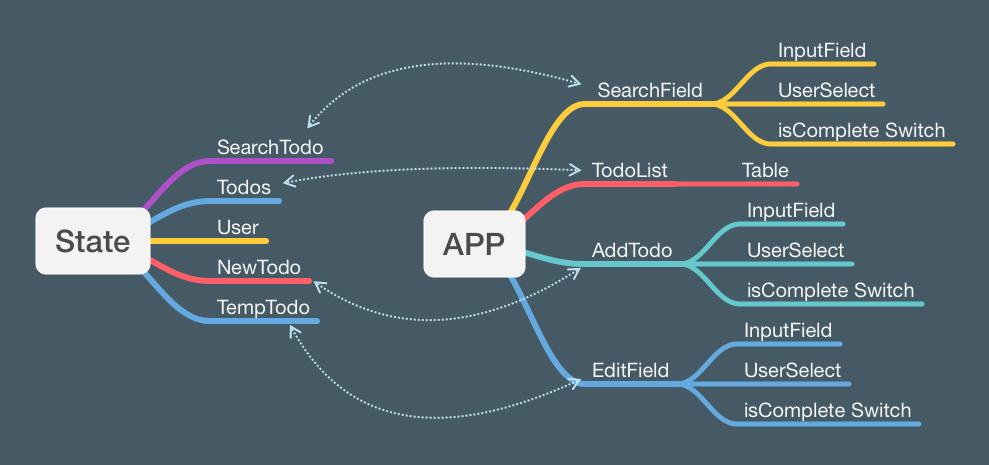

# BlueSky React-TypeScript Todo-APP Task



## Challenges

- implement `useContext` and `useReducer`
- planning components/functions

## Questions

- reducer best practices
- Fix server.ts: to create a new todo, has to query user modal and warp with request data
- Add feature server.ts: to patch existing todo

```javascript
this.post("/todo/create", (schema: any, request) => {
	let attrs = JSON.parse(request.requestBody);

	const user = schema.users.find(attrs.user);
	return schema.todos.create({ ...attrs, user });
}

this.patch("/todo/:id/edit", (schema: any, request) => {
	const todoId = request.params.id;
	let attrs = JSON.parse(request.requestBody);

	const todo = schema.todos.find(todoId).update(attrs);

	return {
		todo: todo,
	};
});
```

## Takeaways

- Mirage js Server for mocking server API
- Redux-like state management
- Material UI implement

---

# Original task description

This project was bootstrapped with [Create React App](https://github.com/facebook/create-react-app).

## Steps setup to the App

- npm install
- npm start

## Required Packages

some these will need to be installed and set up

- [Material UI](https://material-ui.com/)
- [React Select](https://react-select.com/home)
- [Axios](https://github.com/axios/axios)
- Typescript

### Requirements

- List Tasks
- Filter tasks by name, user, is completed
- Add Task
- Edit Task
- Delete Task
- Global State (React Hooks and Context Providers)

### What we are looking for

We are looking mainly at how the code is structred and organsied but we also expect you to use a ui libary to build render so it looks good.

Im you have any questions please feel free to ask, also if you need any extra api's added please feel free to reach out

API's Already Implemented

- GET api/todos
- GET api/todo/:id
- DELETE api/todo/:id/delete
- POST api/todo/create
- GET api/users
- GET api/user/id/todos

### Mockups


